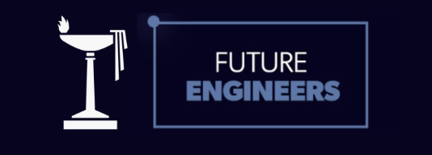

<div align="center">

# The Doon School: WRO Future Engineers 2026



### Engineering the autonomous vehicle for the World Robot Olympiad Future Engineers category


[Explore the project](#explore-the-project) · [System architecture](#system-architecture) · [Team](#team) · [Roadmap](#development-roadmap)

</div>

---

## Table of Contents

- [Overview](#overview)
- [Team](#team)
- [System Architecture](#system-architecture)
- [Mechanical Design](#mechanical-design)
- [Electronics and Power](#electronics-and-power)
- [Software and Obstacle Strategy](#software-and-obstacle-strategy)
- [Testing, Iteration and Evidence](#testing-iteration-and-evidence)
- [Visuals](#visuals)
- [Build and Upload](#build-and-upload)
- [Repository Use and Attribution](#repository-use-and-attribution)
- [Explore the Project](#explore-the-project)
- [Robot Visualisations](#robot-visualisations)
- [Documentation Standard](#documentation-standard)
- [Development Roadmap](#development-roadmap)
- [Repository History](#repository-history)
- [License](#license)

---

## Overview

This repository documents our work for **The Doon School Future Engineers** team competing at **WRO 2026 (GMR Arena, Hyderabad, 26–28 August 2026)**.

It captures the team's submitted vehicle configuration, software architecture, documentation structure, and engineering process. The vehicle is a 4-wheel autonomous car built to the WRO 2026 Future Engineers rules:

- **One driving axle + one steering actuator** per WRO rules.
- **Envelope:** ≤ 300 × 200 × 300 mm; **mass:** ≤ 1.5 kg.
- **No wireless** control during the run.


This documents our current vehicle design. Specifications, code, renders, and test results are in separate sections.

---

## Team

| Member | Focus |
| --- | --- |
| Dhrubo Mishra | Mechanical design |
| Vivaan Kumbhat | Software development |
| Yug Jain | Electronics, systems, and repository integration |
| Mr. Ashutosh Tripathi | Head mentor |

**School:** The Doon School, Dehradun, India
**Category:** WRO 2026: Future Engineers

---

## System Architecture

The vehicle separates **high-level perception and decision-making** (Raspberry Pi 4B) from **low-level actuator control** (ESP32). The Pi interprets the camera, decides steering/speed targets, and sends bounded commands over USB serial; the ESP32 drives the servo and motor and holds the safety state machine.

```text
Pi Camera Module 3 Wide
        │
Raspberry Pi 4B  ──(USB serial, 115200 baud)──►  ESP32
        │                                            │
   perception +                                   MG996R servo
     decision                                     (Ackermann)
                                                  TB6612FNG → N20 (rear axle)
```

| Layer | Input | Responsibility | Output | Module |
| --- | --- | --- | --- | --- |
| Perception | Camera frames | Detect colour cues / geometry | Feature observations | Pi camera + `wromain.py` |
| Decision | Observations + vehicle state | Route, avoid, recover, stop | Steering + speed targets | `wromain.py` |
| Control | Steering + speed targets | Constrain & actuate | Servo / PWM signals | `obstacleChallenge.ino` |
| Vehicle | Actuator signals | Steering + propulsion | Physical motion | Chassis + drivetrain |

> [!NOTE]
> This architecture is the submitted engineering reference. Test records and implementation evidence are kept separately from the configuration description.

### Vehicle specification (submitted configuration)

| Item | Specification |
| --- | --- |
| High-level compute | Raspberry Pi 4B |
| Low-level controller | ESP32 DevKit |
| Camera | Raspberry Pi Camera Module 3 **Wide** |
| Drive | **Rear-wheel drive**, 1 × N20 6 V 600 RPM on the rear axle |
| Steering | Front **MG996R** servo + **Ackermann linkage (LEGO beams/pins)**, 40° outer lock |
| Distance sensing | **VL53L0X** ToF (primary) + **HC-SR04** ultrasonic (redundant) |
| Orientation | **MPU6050** 6-axis IMU (DFRobot Fermion) |
| Motor driver | **TB6612FNG** (1 A/channel) |
| Chassis | 3 mm laser-cut plywood (LightBurn), brass standoff offsets, two decks |
| Battery | **11 V 3S LiPo** → motor/servo rail ~6 V (within N20 6 V and MG996R 4.8–7.2 V ratings); logic rail 5 V |
| Envelope / mass | ≤ 300 × 200 × 300 mm, ≤ 1.5 kg |

The rear N20 and its wheels are deliberately **smaller than the front wheels**, lowering the drive mass and giving the chassis a slight rearward tilt for corner stability.

---

## Mechanical Design

Full detail: [`design/README.md`](design/README.md).

Key points of the submitted configuration:

- **Front Ackermann steering** driven by an MG996R servo. The steering arms, knuckles and tie-rod geometry are built from **LEGO beams and pins** on a front sub-frame, so the Ackermann trapezoid can be re-jigged in 8 mm steps during tuning without re-cutting the chassis. Outer lock was iterated **31° → 40°** to clear the 600 mm corridor 90° corners (see journal Entry 04).
- **Fully rear-wheel drive** with one N20 6 V 600 RPM motor on the rear axle: Rule 11.13 compliant (one driving axle, no independent side motors). Rear wheels are smaller than the front, producing the rearward tilt described above.
- **Two-deck 3 mm plywood chassis**, laser-cut in **LightBurn**. Upper deck carries the Raspberry Pi 4B + Camera Module 3 Wide; lower deck carries the 11 V 3S LiPo pack, ESP32 and TB6612FNG. The decks are spaced by **brass standoff offsets**, with LEGO used as adjustable mounting rails.
- **Chassis:** 3 mm plywood, laser-cut in LightBurn. The DXF export [`wooden_plate.dxf`](design/wooden_plate.dxf) is committed (currently a placeholder rectangle; see [cut file notes](design/dxf_notes.md)). The full deck patterns and `.lbrn` LightBurn project are pending.
- **Mechanical BOM:** [`design/bom_mechanical.md`](design/bom_mechanical.md) lists every chassis and drivetrain part with status; the electronics parts list is in [`electronics/README.md`](electronics/README.md) (Bill of materials section).

---

## Electronics and Power

Full detail: [`electronics/README.md`](electronics/README.md) · Wiring: [`hardware/wiring-guide/README.md`](hardware/wiring-guide/README.md).

- **Two-rail power from one 11 V 3S LiPo pack:** the motor/servo rail is buck-regulated to ~6 V (within the N20 6 V and MG996R 4.8–7.2 V ratings) for the N20 + MG996R; the logic rail is buck-regulated to 5 V for the Pi 4B, ESP32, HC-SR04, VL53L0X and MPU6050.
- **Star grounding:** all logic grounds meet at one point; motor/servo currents return separately, keeping servo/motor noise out of the logic reference.
- **Protection:** both rails fused. The ESP32 enters `MODE_FAULT` (motor stop + centred steering) on serial timeout (>350 ms) or an invalid command; a logic-rail brownout resets the ESP32 into `MODE_STOP`, which is also motor-off and steering-centred.
- **Pin assignments** for the ESP32 (MG996R → GPIO 13; TB6612FNG PWMA/AIN1/AIN2/STBY → GPIO 25/26/27/32; status LEDs → GPIO 2/4) and the Pi↔ESP32 USB-serial link (115200 baud; messages `CMD,<steer>,<pwm>,<mode>` with `<mode>` ∈ {`DRIVE`, `PARK`, `FINISH`, `STOP`}, plus bare `STOP` and `PING`) are documented in the wiring guide.

> [!NOTE]
> The vehicle is in the development and integration phase; measured rail currents and calibrated values will be added to the testing records as subsystems are verified.

---

## Software and Obstacle Strategy

Full detail: [`strategy/README.md`](strategy/README.md) · Pi code: [`software/raspberry_pi/wromain.py`](software/raspberry_pi/wromain.py) · ESP32 code: [`software/esp32/obstacleChallenge.ino`](software/esp32/obstacleChallenge.ino).

Two-layer software:

- **Raspberry Pi (`wromain.py`):** camera frames → 3×3 colour grid → per-cell HSV masks (red, green, purple (the WRO magenta parking blocks), orange and blue; black is the neutral background cell) → contour detection → target selection → lateral-error **PD steering** → dynamic drive speed. PD (not full PID) is used deliberately: no sustained steady-state error needs the integral term, and D-only damping prevents corner oscillation.
- **ESP32 (`obstacleChallenge.ino`):** executes bounded commands through a safety state machine with internal states `MODE_DRIVE`, `MODE_PARK`, `MODE_STOP`, `MODE_FINISH`, `MODE_FAULT` (the Pi sends only the wire tokens `DRIVE`, `PARK`, `FINISH`, `STOP` and `PING`; invalid input drives `MODE_FAULT`). Fault is entered on serial timeout or invalid command: the vehicle always fails safe.

**Obstacle Challenge flow (implemented in code: vision grid + PD steering + watchdog; remaining stages are designed and tracked as planned work):** lane-follow by centring on the corridor (PD on vision offset; wall check is pending the VL53L0X integration) → red pillar pass right / green pillar pass left (colour from the camera grid, +12° bias; ToF clearance check pending) → after 3 laps the Pi sends `PARK`. **Planned but not yet in code:** the start-zone lap detector, the parking manoeuvre, and the IMU heading alignment / ToF depth stop for the magenta (purple) parking blocks. **Open Challenge:** corner handling via the PD controller today; wall-geometry corner detection and orange/blue section-line lap counting are planned.

Edge cases handled in code: lost line (re-acquire by sweep), serial dropout (watchdog fault stop), pillar too close (emergency bias). Planned: parking overshoot recovery with small IMU-controlled steps once the IMU is integrated.

> [!NOTE]
> Build status: the vehicle is in the development and integration phase. Code implements perception (colour grid), PD steering, dynamic speed, and the ESP32 safety state machine; the IMU, VL53L0X ToF, start-zone detector and parking manoeuvre are pending integration (placeholder interfaces in `wromain.py`). Measured results land in [`docs/testing/`](docs/testing/README.md) and [`evidence/`](evidence/README.md) as tests are run.

---

## Testing, Iteration and Evidence

Full detail: [`docs/testing/README.md`](docs/testing/README.md) · Journal: [`docs/engineering_journal/README.md`](docs/engineering_journal/README.md) · Evidence: [`evidence/README.md`](evidence/README.md).

Configuration is kept separate from evidence. A design choice is explained in the architecture/strategy material; an observed conclusion is recorded in the corresponding test record. Each test record lists date, objective, vehicle/software version, setup, procedure, raw observations, result, limitations and next action. Unsuccessful tests are retained as part of the real iteration process.

| Evidence type | Location | Required label |
| --- | --- | --- |
| Design decision | [Engineering journal](docs/engineering_journal/README.md) | Date, author, options, rationale |
| Proposed diagram | [Diagrams / wiring guide](hardware/wiring-guide/README.md) | Proposed + version |
| Physical / software test | [Testing](docs/testing/README.md) | Date, setup, method, observation |
| Test visual | [Test images](images/testing/README.md) | Date and conditions |
| Vehicle view | [Robot images](images/robot/README.md) | Render or dated photograph |
| Run video | [Videos](videos/README.md) | Date, challenge, setup, outcome |

---

## Visuals

The repository keeps team, vehicle, testing and competition visuals in separate folders so context stays clear. Vehicle views in [`images/robot/`](images/robot/README.md) are concept renders of the submitted configuration: design-reference views, not photographs. Competition-day videos are recorded on the day of the event and archived in [`videos/README.md`](videos/README.md).

---

## Build and Upload

The submitted configuration documents the build-and-upload procedure: OS setup, library versions, camera configuration, Pi build command, ESP32 board/environment selection, required libraries (`ESP32Servo`, OpenCV), upload method, communication setup and a safe power-on sequence. Measured verification is maintained in the testing record rather than implied by the instructions.

- Pi: `software/raspberry_pi/wromain.py` (OpenCV + camera input).
- ESP32: `software/esp32/obstacleChallenge.ino` (uses `ESP32Servo`).

Exact dependencies and compile/upload commands belong in the respective software folders, linked to the journal records.

---

## Repository Use and Attribution

This repository contains our own work. We do not copy other teams' designs or code. Git history records our progress.

The documentation is organised against the five WRO 2026 Future Engineers criteria (Mobility & Mechanical Design, Power & Sensor Architecture, Software Architecture & Obstacle Strategy, Systems Thinking & Engineering Decisions, Reproducibility & GitHub Quality). The mapping from each criterion to the relevant files is maintained in [`docs/README.md`](docs/README.md).

---
## Explore the Project

| Area | Contents | Status |
| --- | --- | --- |
| [`design/`](design/) | Vehicle layout, mechanical decisions, LightBurn/DXF, mechanical BOM | Configuration |
| [`electronics/`](electronics/) | Components, power plan, wiring, pin assignments | System reference |
| [`strategy/`](strategy/) | Open / Obstacle Challenge logic and flow | Decision architecture |
| [`software/`](software/) | Raspberry Pi (`wromain.py`) and ESP32 (`obstacleChallenge.ino`) source | Control software |
| [`docs/`](docs/) | Engineering journal, diagrams, testing records | Engineering record |
| [`images/`](images/) | Team, robot (renders), testing, competition visuals | Visual reference |
| [`videos/`](videos/) | Dated run and presentation videos (competition day) | Run records |
| [`evidence/`](evidence/) | Dated reviews, calibration and test summaries | Evidence archive |

---

## Robot Visualisations

Visuals in [`images/robot/`](images/robot/) are concept renders of the submitted vehicle configuration: design-reference views, not photographs.

---

## Documentation Standard

We keep design docs, code, and test results separate.

- Each test record has date, setup, method, observations and next action.
- Renders are not photographs of the real vehicle.
- We keep unsuccessful attempts as part of the learning process.

---

## Development Roadmap

| Phase | Focus | Evidence added when complete |
| --- | --- | --- |
| `01` | Define architecture and component choices | Dated design decision |
| `02` | Assemble and document the first prototype | Labelled photographs and wiring record |
| `03` | Implement perception, control and communication | Source code and software test record |
| `04` | Test subsystems | Measured, dated test results |
| `05` | Integrate the vehicle | Complete challenge evidence |

---

## Repository History

This repository uses GitHub to track our engineering progress. Updates are committed as the team's work evolves.

---

## License

Published for educational use as part of WRO Future Engineers. Team materials may be updated during development.
